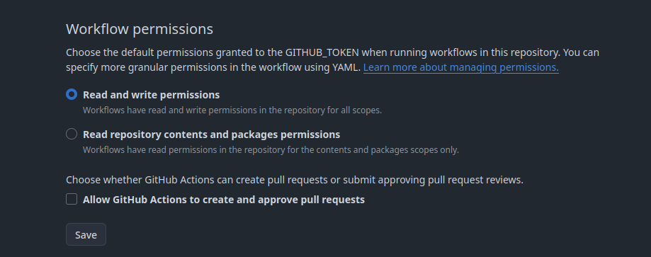
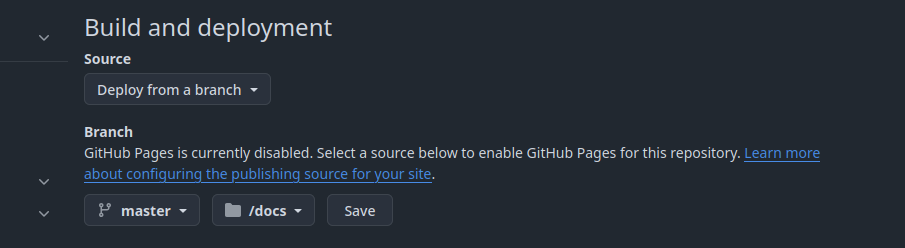

<h2 align="center">
<br/>
<br/>
Liveboat demo
</h2>

This is Liveboat template repository, use it to configure and deploy feed websites on Github Pages. Follow instructions below for more details.

## Installation

Prerequisites: 
- Existing Newsboat configuration, in particular `urls` file. If that does not ring a bell see [Newsboat documentation](https://newsboat.org/releases/2.10.2/docs/newsboat.html) for setup instructions.
- Github account

__STEP 1__ Create new Github project 

> [!NOTE]
> Repository can be private or public however note that hosting project pages from private repos is only available for Github Pro users.

__STEP 2__ Clone `liveboat-demo` repository and update it's remote to that created in previous step

``` sh
git clone git@github.com:exaroth/liveboat-demo.git && cd liveboat-demo;
git remote rm origin && git remote add origin remote add origin git@github.com:<your_username>/<repo_name>
```

__STEP 3__ Update configuration and urls file

- First edit `./config/liveboat-config.toml` file, update `title` option and most importantly `site_path` - this option needs to be set `/<repo_name>/` where `repo_name` corresponds to repository name created in Step 1.

- Next update Newsboat url feeds in `./config/newsboat-urls` file - replacing existing config with contents of your local `urls` file (typically stored at `~/.newsboat/urls`)

> [!NOTE]
> Order of the URLs does matter as it will reflect order of feeds in generated page.

__STEP 4__ After updating all the files commit them to the repository and push to remote
```sh
git push --set-upstream origin master
```

__STEP 5__ Update settings for the repository

1. Go to `Settings->Actions->General` page within the repo created in Step 1. In `Workflow Permissions` section set `Read and write permissions` and click `Save`.

2. Still in Project Settings go to `Pages` tab and under `Build and deployment`, set `Source` to `Deploy from branch`, set `Branch name` to `master` and select `/docs` as the folder to deploy Pages from. Click `Save`.


__STEP 6__ Finally going back to terminal execute
``` sh
git tag build && git push --tags
```
To execute page rebuild job.

> [!TIP]
> Pushing any tag starting with `build` will execute page rebuild job

__DONE__ Wait until Github Actions finish execution, then navigate to the repo Github Page `https:;//<username>/github.io/<repo_name>` and verify everything is as expected.

## Newsboat cache persistence

By default Newsboat cache file containing feed data is not being persisted in between feed rebuilds - this means that only articles retrieved during current Newsboat reload will be processed. To change that set `PERSIST_NEWSBOAT_CACHE` to `1` within `./config/page_options` file, this will cause Newsboat db cache to be saved after every update. Additionally set `NEWSBOAT_CACHE_RETENTION_DAYS` to number of days articles will be stored in db (ideally this should match `keep-articles-days` in `./config/newsboat-config` file).

## Changing build time intervals
By default feed page will be rebuilt every hour, if you want to change it edit `.github/workflows/workflow.yml` and update schedule definition
```
  schedule:
    - cron: "0 * * * *"

```
## Template updates

In order to manually update `Liveboat` binary and templates execute `make update` alternatively you can enable automatic updates by setting `CHECK_FOR_UPDATES` to `1` in `./config/page_options` file

## License
Liveboat is provided under MIT License, see `LICENSE` file for details
